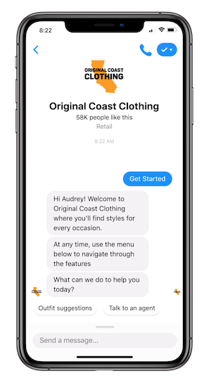

# Original Coast Clothing Messenger Bot

Original Coast Clothing (OC) is a fictional clothing brand created to showcase key features of the Messenger Platform. OC leverages key features to deliver a great customer experience. Using this demo as inspiration, you can create a delightful messaging experience that leverages both automation and live customer support. We are also providing the open source code of the app and a guide to deploy the experience on your local environment or remote server.

[Access the Messenger experience](https://m.me/OriginalCoastClothing?ref=GITHUB)



See the [Developer Documentations on this experience](https://developers.facebook.com/docs/messenger-platform/getting-started/sample-apps/original-coast-clothing).

# Setting up your Messenger App

## Requirements

- **Facebook Page:** Will be used as the identity of your messaging experience. When people chat with your page. To create a new Page, visit https://www.facebook.com/pages/create.
- **Facebook Developer Account:** Required to create new apps, which are the core of any Facebook integration. You can create a new developer account by going to the [Facebook Developers website](https://developers.facebook.com/) and clicking the "Get Started" button.
- **Facebook App:** Contains the settings for your Messenger automation, including access tokens. To create a new app, visit your [app dashboard](https://developers.facebook.com/apps).

## Setup Steps

Before you begin, make sure you have completed all of the requirements listed above. At this point you should have a Page and a registered Facebook App.

#### Get the App id and App Secret

1. Go to your app Basic Settings, [Find your app here](https://developers.facebook.com/apps)
2. Save the **App ID** number and the **App Secret**

#### Grant  Messenger access to your Facebook App

1. Go to your app Dashboard
2. Under _Add Product_ find _Messenger_ and click _Set Up_
3. Now you should be in the App Messenger Settings
4. Under Access Tokens, click on _Add or Remove Pages_
5. Select the desired page and allow "Manage and access Page conversations" in Messenger
6. Select the desired page and an access token should appear
7. Get the Page ID from the page access token by using the [Access Token Debugger](https://developers.facebook.com/tools/debug/accesstoken/)
8. In the section Built-In NLP, select your page and enable the toggle

# Installation

Clone this repository on your local machine:

```bash
$ git clone git@github.com:fbsamples/original-coast-clothing.git
$ cd original-coast-clothing
```

You will need:

- [Node](https://nodejs.org/en/) 10.x or higher
- Remote server service such as [Heroku](https://www.heroku.com/), a local tunneling service such as [ngrok](https://ngrok.com/), or your own webserver.

# Usage

## Using ngrok

#### 1. Install tunneling service

If not already installed, install ngrok via [download](https://ngrok.com/download) or via command line:

```bash
npm install -g ngrok
```

In the directory of this repo, request a tunnel to your local server with your preferred port
```bash
ngrok http 3000
```

The screen should show the ngrok status:

```
Session Status                online
Account                       Redacted (Plan: Free)
Version                       2.3.35
Region                        United States (us)
Web Interface                 http://127.0.0.1:4040
Forwarding                    http://1c3b838deacb.ngrok.io -> http://localhost:3000
Forwarding                    https://1c3b838deacb.ngrok.io -> http://localhost:3000

Connections                   ttl     opn     rt1     rt5     p50     p90
                              0       0       0.00    0.00    0.00    0.00
```
Note the https URL of the external server that is fowarded to your local machine. In the above example, it is `https://1c3b838deacb.ngrok.io`.

#### 2. Install the dependencies

Open a new terminal tab, also in the repo directiory.

```bash
$ npm install
```

Alternatively, you can use [Yarn](https://yarnpkg.com/en/):

```bash
$ yarn install
```

#### 3. Set up .env file

Copy the file `.sample.env` to `.env`

```bash
cp .sample.env .env
```

Edit the `.env` file to add all the values for your app and page. Note that `APP_URL` will be the external URL from step 1.

#### 4. Run your app locally

```bash
node app.js
```

You should now be able to access the application in your browser at [http://localhost:3000](http://localhost:3000)

Confirm that you canalso access it at the external URL from step 1.

#### 5. Configure your webhook subcription and set the Messenger profile

Use the `VERIFY_TOKEN` that you created in `.env` file and call the **/profile** endpoint in your browser or via cURL:
```
http://localhost:3000/profile?mode=all&verify_token=verify-tokenl
```

This will configure your webhook.

#### 6. Test that your app setup is successful

Send a message to your Page from Facebook or in Messenger.

You should see the webhook called in the ngrok terminal tab, and in your application terminal tab.

If you see a response to your message in messenger, you have fully set up your app! Voilà!

## Using Heroku

#### 1. Install the Heroku CLI

Download and install the [Heroku CLI](https://devcenter.heroku.com/articles/heroku-cli)

#### 2. Create an app from the CLI

```bash
heroku apps:create
# Creating app... done, ⬢ mystic-wind-83
# Created http://mystic-wind-83.herokuapp.com/ | git@heroku.com:mystic-wind-83.git
```

Note the name given to your app. In this example, it was `mystic-wind-83`.

#### 3. Set your environment variables

On the [Heroku App Dashboard](https://dashboard.heroku.com/), find your app and set up the config vars following the comments in the file ```.sample.env```

Alternatively, you can set env variables from the command line like this:

 ```bash
heroku config:set PAGE_ID=XXXX
```

#### 4. Deploy the code

```bash
git push heroku main
```

#### 5. View log output

```bash
heroku logs --tail
```

#### 6. Configure your webhook subscription and set the Messenger profile
  You should now be able to access the application. Use the ```VERIFY_TOKEN``` that you created as a config var and call the **/profile** endpoint on your app like so:

  ```
  http://<YOUR APP NAME>.herokuapp.com/profile?mode=all&verify_token=<VERIFY_TOKEN>
  ```

#### 6. Test that your app setup is successful

Send a message to your page from Facebook or in Messenger. If your webhook receives an event, you have fully set up your app! Voilà!

## License

Sample Messenger App Original Coast Clothing is BSD licensed, as found in the LICENSE file.

See the [CONTRIBUTING](CONTRIBUTING.md) file for how to help out.

Terms of Use - https://opensource.facebook.com/legal/terms
Privacy Policy - https://opensource.facebook.com/legal/privacy
